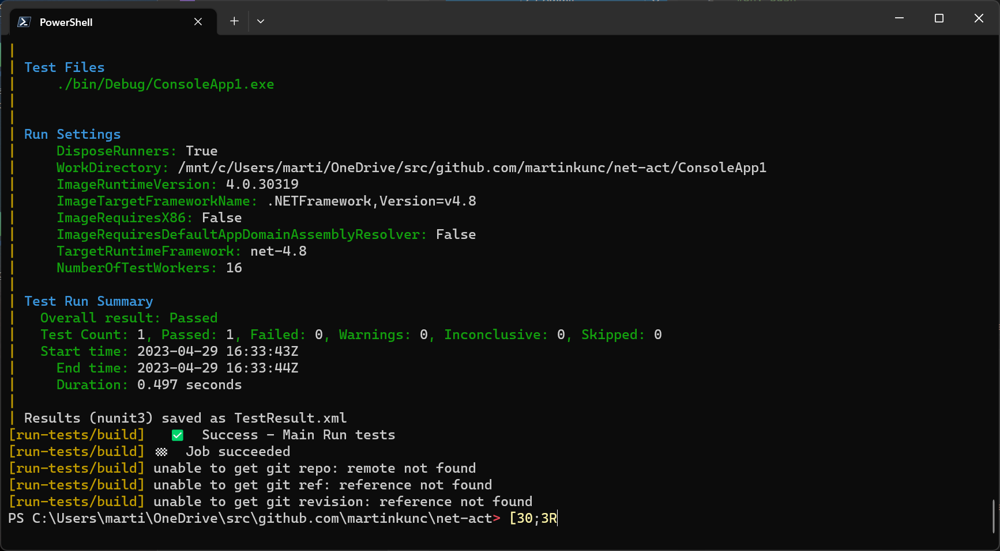

### Example repository for .net framework unit test with local github workflow.

The idea was to have local container to run .net framework tests from a repo.

The [act](https://github.com/nektos/act) is an awesome tool for running github workflows locally in containers and this repo is an attempt to use it.
 
### Installation with powershell
```
winget install nektos.act
winget install -e --id suse.RancherDesktop
Run Rancher Desktop to finish installation:
& "$(USERPROFILE)\AppData\Local\Programs\Rancher Desktop\Rancher Desktop.exe"
```

### building test image and running tests

List available workflows:
```
act -l
```

Build test docker image:
```
act -j 'docker-image-test'
```


Compile solution and run the test
```
act -j 'build'
```

Watch folder for changes and run tests continuously
It looks like it doesn't work on windows well.

```
act -w -j 'build'
```

Result:

